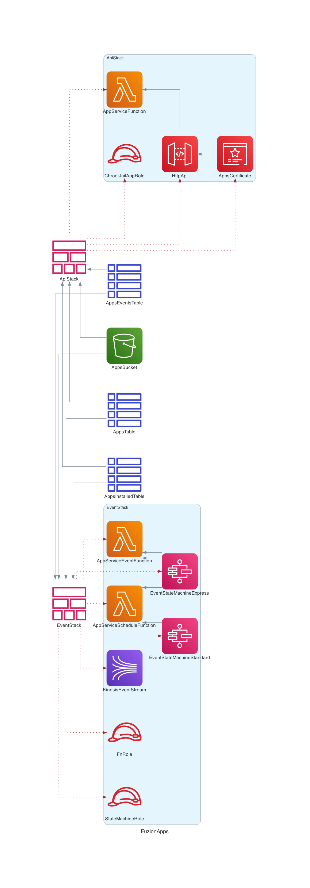

# AWS Cloudformation diagrams

Generate dynamic diagram of **AWS Cloudformation** template from **YAML** file.

## Thanks

Special thanks to the work of [MinJae Kwon](https://github.com/mingrammer) with it's powerful Diagram As Code tool 
https://github.com/mingrammer/diagrams

## How to use it?

```
$ pip3 install -r requirements.txt
$ python3 src/main.py -i /YOUR/PATH/main.yml -o MySuperSchema -f pdf
```

## Examples

Look at some examples of real project generated in `examples` folder.

### Fuzion APPS Schema

